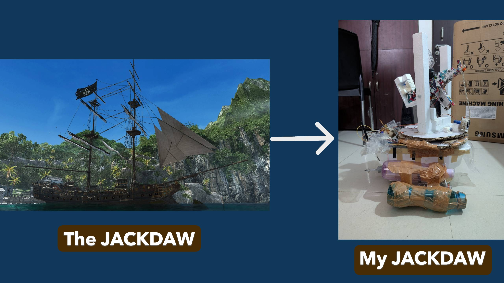
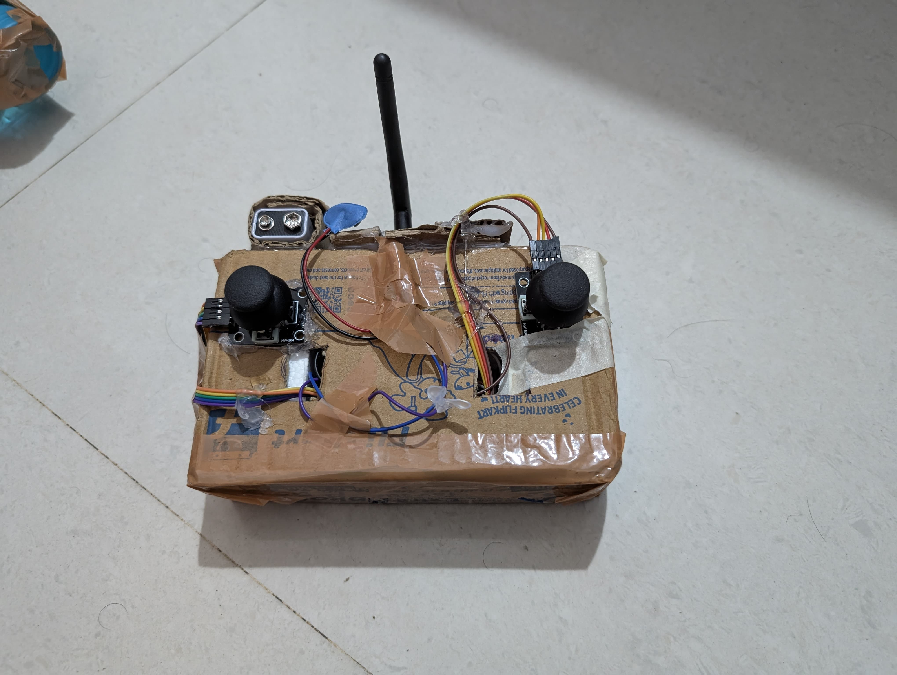

## Why I Built It  

Building this RC warship was the perfect project to merge my passions for **naval history, model building, and electronics**.  

I’ve always been fascinated by detailed ships in games like *Assassin’s Creed IV: Black Flag* and movies like *Pirates of the Caribbean*, where naval battles and futuristic mechanisms spark the imagination. That inspiration, combined with my engineering curiosity, pushed me to go beyond making a static replica—I wanted a **fully operational, remote-controlled warship**.  

My goal was to turn that curiosity into a **hands-on learning experience** and an **entry point into microcontrollers and wireless communication**. Along the way, I explored and learned:  

- **Electronics & Programming** – Controlling motors and servos with an Arduino, and setting up wireless communication with nRF modules.  
- **Propulsion Systems** – Using dual motors for both thrust and steering, while managing speed and direction precisely.  
- **Waterproofing** – A critical challenge. My first attempt with cheap motors failed after only 15 minutes, even with hot-glue sealing. That failure taught me the importance of proper component selection and protection.  
- **RC Transmitter Design** – Building a custom transmitter with joysticks and potentiometers for responsive, intuitive control.  

The most rewarding moment was watching everything—mechanical build, wiring, and code—come together into a **dynamic, functional RC warship**. This project not only gave me a working model but also marked the beginning of my journey into **embedded systems and practical electronics**.  

## 📡 How I Made the Remote  

Designing the **remote control** was as exciting as building the warship itself, because it meant creating an interface that felt **intuitive and reliable**—just like a real ship’s control system. Instead of buying an RC transmitter, I challenged myself to **build one from scratch**, which gave me complete freedom over the layout and functionality.  

---

### 🔹 Why I Started with the Remote  
The documentation begins with the **remote** because that’s how this entire project started.  
My first success was getting **two nRF24L01 modules** (one on the remote, one on the boat) to send and receive basic joystick data (0–1023 values).  

- At first, these values were just **proof of communication**.  
- Later, they became **critical control signals**:  
  - **Motor Speed** → mapped from joystick forward/back values.  
  - **Gun Angle** → mapped from joystick side/up-down values.  
  - **Gun Fire Command** → triggered by pressing the joystick button (yes, this fired the Orbeez cannon 😆).  

That very first “**Fire!**” moment really felt like being a pirate captain giving the order.  

---

### 🔹 Electronics & Structure of the Remote  

At the core of the remote is an **Arduino Nano**, paired with an **nRF24L01 wireless module** (mounted on an adapter with capacitors for stable power). This enabled **low-latency real-time communication** at 2.4 GHz.  

**Main Input System**:  
- **Dual Joysticks**  
  - Left joystick → forward/reverse thrust + differential turning (controls left/right motors).  
  - Right joystick → controls the Orbeez gun (left/right aim, up/down tilt).  
  - Right joystick button → Fire command.  
- **Power Supply** → A 9V battery in a holder.  
- **Custom Enclosure** → Instead of 3D printing, I recycled a Flipkart box:  
  - Openings cut out for joysticks.  
  - A small window for the Arduino Nano’s LED.  
  - Space left for the nRF antenna to stick out.  

**Structural Reinforcement**:  
- Small breadboard in the center for wiring.  
- Thermocol blocks placed under joysticks (to prevent collapsing while pressing).  
- Double-sided tape for mounting.  
- Entire box sealed into a **sturdy DIY controller**.  

---

### 🔹 Software & Communication  

The transmitter software continuously:  
1. Reads joystick + button values.  
2. Converts them into digital signals.  
3. Sends packets wirelessly via the **nRF24L01**.  

On the **boat side**:  
- Another Arduino Nano receives these packets.  
- Values are converted into **motor speeds** and **servo angles** in real-time.  

👉 Full code is available here:  
- **[Transmitter Code]()**  
- **[Receiver Code]()**  

*(Links can be added once you upload your code files to the repo.)*  

---

### 🔹 Challenges & Fixes  

One of the toughest parts was ensuring **stable wireless communication**.  

- **Problem:**  
  Frequent signal drops and interference in the **2.4 GHz band**.  

- **Fixes:**  
  - Used an **nRF adapter (or capacitors)** to prevent power brownouts.  
  - Initially, I powered the **nRF module and servos directly from the Arduino Nano**.  
  - The output was **unstable** because both servos consumed power spikes during rotation.  
  - This caused the **nRF module to receive insufficient power**, breaking communication.  
  - The dropouts even forced me to **reset the Nano** to re-establish connection with the remote.  

After these fixes, the remote became **reliable enough for smooth outdoor operation**.  

---

## 🚢 How the Boat Was Made  

---

### ⚓ Hull and Structure  
The **hull of the warship** was creatively salvaged from **washing machine packaging**. The rest of the body was built entirely from scratch using **cardboard, thermocol (polystyrene foam), and sunboard**.  

These materials were:  
- Lightweight  
- Easy to shape  
- Readily available  
- Low-cost  

This gave me full control over the design while keeping expenses minimal.  

- **Thermocol** → provided buoyancy and formed the inner frame.  
- **Sunboard** → used for outer plating and superstructure to give the warship its final form.  

---

### ⚙ Internal Components (“Passengers”)  
Inside the hull were all the critical systems that powered the boat:  

- **Two DC Motors** → mounted through the hull and glued with hot glue.  
- **L298N Motor Driver** → to control the motors.  
- **Arduino Nano** → mounted on a breadboard, acting as the main controller.  
- **nRF24L01 Module** → for wireless communication, seated on its adapter.  
- **Power Source** → three 4V batteries in series (12V total), the heaviest part of the boat.  
- **Shooting Mechanism** → toy gun mounted on a platform with **servos + relay**.  

---

### 🔬 Physics at Work  

#### 1. Buoyancy  
- Thermocol ensured natural buoyancy.  
- Added **2.5 L bottles** on each side for extra stability (initially to counter gun recoil).  
- Real issue: motors sat too high, not submerged.  
- **Fix:** partially filled bottles with water → lowered hull until propellers dipped underwater.  

### Buoyancy of a 2.5 L Bottle

-A 2.5 L bottle has a volume of 0.0025 m³.

-The density of fresh water is about 1000 kg/m³.

-Gravitational acceleration is about 9.81 m/s².

**So the buoyant force when fully submerged is**:

**Buoyant force = ρ × g × V** = 1000 × 9.81 × 0.0025 ≈ 24.5 N

That’s roughly the same as 2.5 kgf of lift per bottle.
I have bottles on both sides (two 1ltr and one 0.5 ltr bottles on both sides), that gives around 49 N total (~5 kgf).

Partially Filled Bottle (as Ballast)

The buoyant force depends only on the outside volume, but if you add water inside the bottle, the net lift decreases because of the extra weight.

For example, if the bottle is half-filled (1.25 L of water inside):

Net upward force ≈ 12.3 N

After subtracting the bottle’s plastic weight (~0.3–0.5 N), the effective lift is about 12 N.

In Seawater

Seawater is a bit denser (1025 kg/m³).
So the buoyant force of a fully submerged 2.5 L bottle increases slightly to about 25.1 N per bottle.

#### 2. Weight Distribution  
- Initially, components were clustered at the rear → caused backward tilt.  
- Solution: redistributed weight evenly → achieved better stability.  

#### 3. Motor–Propeller Connection  
- Motor shaft too large for propeller hole.  
- DIY fix: used a **pen refill + jumper wire + hot glue** as a coupler.  
- Surprisingly, this hack worked reliably!  

#### 4. Gun Platform Mechanics  
- Gun mounted on a **circular rotating thermocol platform** for horizontal aiming (servo-controlled).  
- Vertical aiming was tricky (servo could only pull downward).  
- **Fixes:**  
  - Added **counterweights** behind the gun → naturally pointed upward.  
  - Servo in front pulled it downward → enabled full vertical motion.  
  - A **U-shaped thermocol frame** stabilized the gun and limited wobble.  

Result → Gun could **aim freely in two axes** (forward direction).  

#### 5. Shooting Mechanism  
- Gun powered continuously, controlled by a **relay switch**.  
- Problem: relay coil generated **back-EMF**, which disrupted motors/servos.  
- **Fix:** added a **diode across relay** to block reverse current.  
- Big lesson: always account for **inductive loads**.  

---

### 🚀 Propulsion and Steering  

- Used **two DC motors** with propellers (controlled via L298N driver).  
- No rudder → instead used **differential thrust**:  
  - **Forward:** both motors at same speed.  
  - **Right turn:** increase left motor speed, reduce right.  
  - **Left turn:** increase right motor speed, reduce left.  

✅ This gave the warship **excellent maneuverability**, even capable of turning almost on the spot.  

---

### 💧 Internal Layout & Waterproofing  

- Electronics arranged neatly inside the hull.  
- Hot-glue sealing applied around all shaft & wire exits.  
- Worked initially, but… motors weren’t waterproof.  
- After extended contact with water, the motors **burned out**.  

⚠️ Lesson learned: **use marine-grade waterproof motors** for long-term durability.  

---

## How the Control System Works  

The RC warship's control system is based on a **master–slave communication setup**.  
- The **Remote (transmitter)** acts as the **master**, sending commands wirelessly.  
- The **Boat (receiver)** acts as the **slave**, executing those commands in real time.  

---

### Communication Link  

The communication is handled by **nRF24L01+ wireless modules**, which provide a **2.4 GHz low-latency link**.  

#### Remote (Transmitter – Arduino Nano)  
- Continuously reads joystick values (`xValue`, `yValue`) and the fire button (`buttonState`).  
- Packages them into a data structure (`Data_Packet`).  
- Sends the data using `radio.write()`.  

#### Boat (Receiver – Arduino Nano)  
- Continuously listens for incoming packets using `radio.available()`.  
- Reads the data structure using `radio.read()`.  
- Maps the received values to motor and servo outputs.  

---

### Software Logic  

The Arduino code translates **joystick inputs** into **real-time actions** on the boat.  

#### 1. Input Mapping (Transmitter Side)  
- Joysticks are read as **analog values (0–1023)**.  
-	These are converted using the map() function:
  o	yValue → forward/reverse motor speed.
  o	xValue → left/right steering.
•	Example from code:
  1)data.yValue = map(analogRead(A1), 0, 1023, -255, 255);
 	2)data.xValue = map(analogRead(A0), 0, 1023, -255, 255);
  3)data.buttonState = digitalRead(2);

This ensures the raw values are scaled to meaningful motor/servo ranges.

#### 2. Signal Decoding (Receiver Side)

•	When a packet is received:

if (radio.available()) {
    radio.read(&data, sizeof(Data_Packet));
}
•	The values (yValue, xValue, buttonState) are then fed into motor and servo control functions.

#### 3. Motor & Servo Control

•	The differential steering logic is implemented:
  int leftMotorSpeed = data.yValue + data.xValue;
	int rightMotorSpeed = data.yValue - data.xValue;
•	This lets the warship steer by varying the motor speeds independently.
•	Motor speeds are applied using analogWrite() to the L298N driver pins.
•	The servo angles are controlled via:
	servo.write(map(data.xValue, -255, 255, 0, 180));
•	The gun relay is toggled directly from the fire button:
	digitalWrite(gunPin, data.buttonState);

---

## ⚙️ Control System Flow

### 🛰️ Transmitter (Remote)
1. Read joystick and button inputs.  
2. Package values into `Data_Packet`.  
3. Transmit packet via **nRF24L01**.  
4. Repeat continuously.  

### 🚤 Receiver (Boat)
1. Listen for incoming packets.  
2. If a packet is available:  
   - Decode values.  
   - Apply motor control logic.  
   - Update servos.  
   - Trigger gun relay if needed.  

3. Fail-Safe Behavior  
- If **no packet is received** it reverts to a **default safe state**:  
  - Motors stop.  
  - Servos hold neutral position.  
  - Gun relay remains inactive. 

---

## 🛡️ Safety Features
- **Current Implementation**  
  No explicit failsafe, but the motors only act when new data is received.   

- **Physical Safety**  
  The boat’s thermocol hull ensures buoyancy, making it unsinkable even in case of system failure.  

## Ideas and Applications

### 1. Conceptual (Wargame Simulation)
- **Swarm Fleet Simulation**: Imagine a fleet of 50 small RC warships working together, coordinated like a “mosquito swarm” to simulate naval combat strategies.  
- **Operator + Autonomy**: Instead of manually piloting each ship, one operator can assign objectives and the fleet handles coordination automatically.  
- **Targeting Simulation**: A camera system and targeting interface could be integrated to practice detection, aiming, and precision strikes (in simulation, not real weaponry).  
- Drive it around ponds, lakes, or pools for fun.  
- Engage in mock naval battles with other RC boats.
- Can be viewed as a Recreational RC Warship.
> **Note**: These are purely for simulation, research, or gaming purposes — not actual weaponization.

---

### 2. Non-Violent Real-World Uses
- **Pisciculture (Fish Farming)**  
  - Dispensing food at set times.  
  - Monitoring water quality (pH, oxygen levels) and alerting when parameters are off.  
  - Tracking fish movement in large water bodies to aid efficient harvesting.   

### 3. Surveillance & Monitoring  
- Mount a small FPV/HD camera for live streaming.  
- Use it to monitor ponds, lakes, fish farms, or restricted areas.  

### 4. Rescue & Retrieval  
- Attach a hook, net, or small grabber arm to retrieve floating objects.  
- Deploy it to carry ropes or lightweight payloads during emergencies.  

---

### 3. Lessons Learned
1. Use water-specialized motors for better durability.  
2. Create a 3D-printed hull and gun platform for precision.  
3. Build a 3D-modeled remote for a more professional look and ergonomics.  

---

### 4. Future Improvements
- **Camera Feed (FPV)**: Real-time first-person video feed for immersive control.  
- **Autonomous Navigation**: Using GPS + sensors to follow waypoints or hold course.  
- **Enhanced Waterproofing**: Marine-grade motors, sealed enclosures.  
- **Upgraded Weapon Systems (Safe Options)**: Replace toy gun with water cannon, water balloon launcher, or mock torpedoes for fun battles.  
- **App-Based Control**: Swap nRF module for Wi-Fi/Bluetooth to control directly via smartphone app.  

